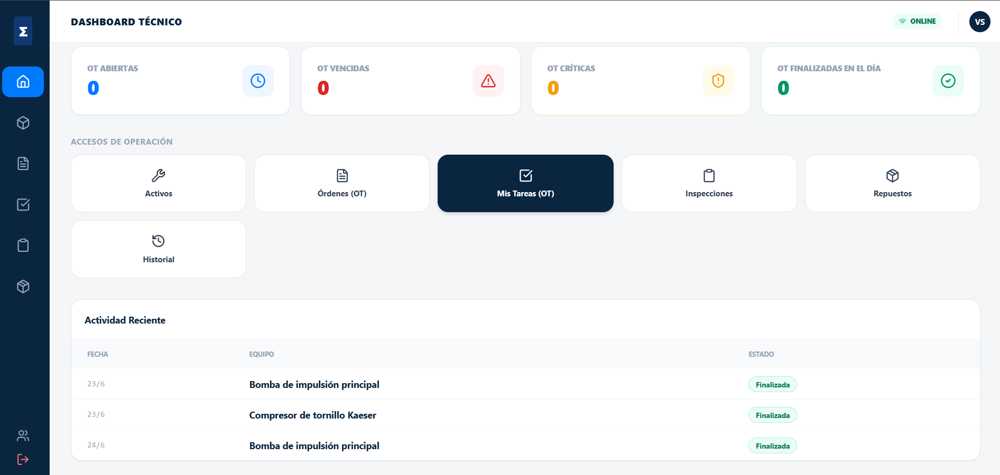
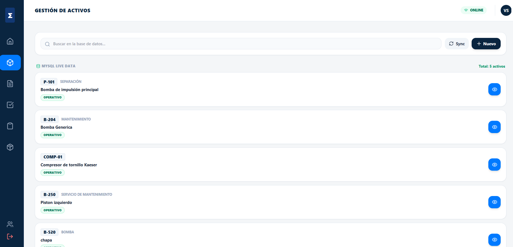
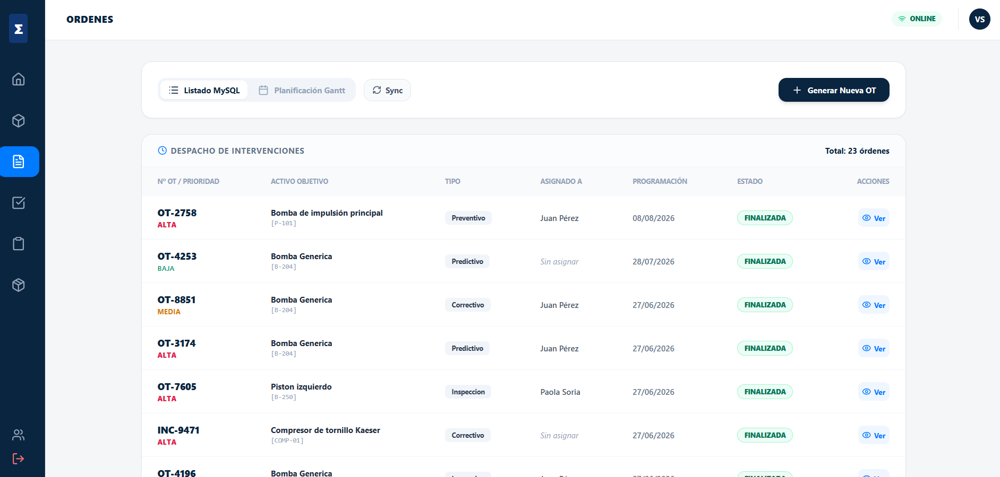
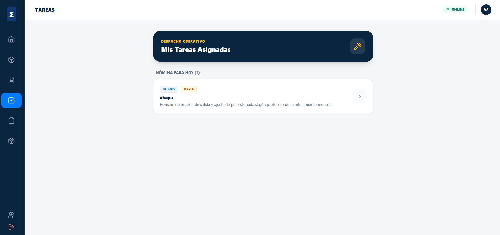
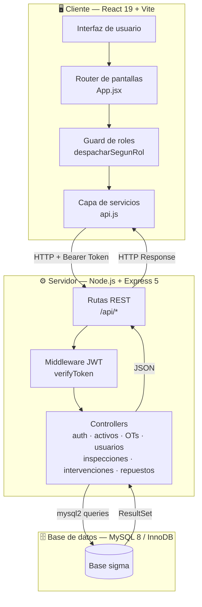
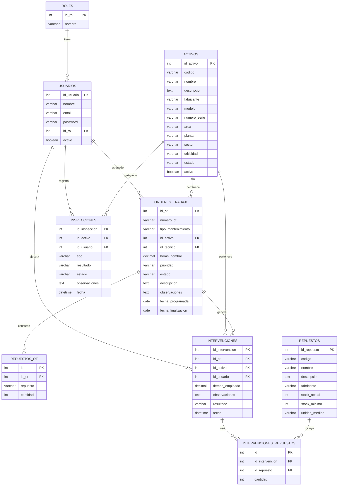
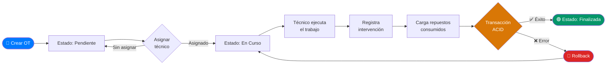
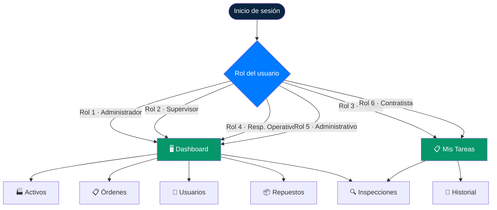

<div align="center">


# SIGMA
### Sistema de Gestión de Mantenimiento Asistido

*Proyecto Integrador Final · Tecnicatura en Desarrollo de Software · 2026*

<br/>

[](https://nodejs.org)
[](https://react.dev)
[](https://mysql.com)
[](https://vitejs.dev)
[](https://jwt.io)
[](LICENSE)

<br/>

> **SIGMA** es una aplicación web de tipo CMMS *(Computerized Maintenance Management System)*  
> que permite a plantas industriales gestionar el mantenimiento de sus activos de forma centralizada.

</div>

---

## 📸 Capturas de pantalla


<div align="center">

### Panel de control

*Vista principal para supervisores y administradores con KPIs en tiempo real*

<br/>

### Gestión de Activos

*Listado de activos industriales con estado y criticidad*

<br/>

### Órdenes de Trabajo

*Creación y seguimiento de órdenes con asignación de técnico*

<br/>

### Mis Tareas — Vista del Técnico

*Vista personalizada para técnicos de campo con sus OTs asignadas*

</div>

---

## 🏗️ Arquitectura del sistema



---

## 🗄️ Modelo de base de datos



---

## 🔄 Flujo de una Orden de Trabajo



---

## 👥 Roles y accesos



---

## ✨ Funcionalidades

<table>
<tr>
<td width="50%">

**🏭 Gestión de Activos**
- Alta, edición y baja lógica de equipos industriales
- Ficha técnica completa (fabricante, modelo, número de serie, sector)
- Control de criticidad y estado operativo
- Generación de código QR por activo
- Ficha PDF imprimible desde el navegador

</td>
<td width="50%">

**📋 Órdenes de Trabajo**
- Ciclo de estados: `Pendiente → En Curso → Finalizada`
- Asignación a técnico responsable
- Actualización con repuestos consumidos via transacción ACID
- Filtros por activo y por técnico
- Vista de calendario integrada

</td>
</tr>
<tr>
<td>

**🔍 Inspecciones de Campo**
- Registro de anomalías con tipo, resultado y criticidad
- Generación automática de OT correctiva al reportar alerta
- Historial de inspecciones por activo

</td>
<td>

**👥 Usuarios y Roles**
- 6 roles predefinidos con vistas diferenciadas
- Autenticación JWT con vigencia de 8 horas
- Contraseñas hasheadas con bcrypt
- Activación y suspensión (soft-delete)

</td>
</tr>
<tr>
<td>

**🔧 Intervenciones Técnicas**
- Registro del trabajo ejecutado al cerrar una OT
- Trazabilidad completa por activo y por orden

</td>
<td>

**📦 Repuestos y Stock**
- Catálogo con alertas de punto de pedido
- Estados: Stock Normal / Punto de Pedido / Sin Stock
- Descuento automático de stock al registrar consumo

</td>
</tr>
</table>

---

## 🛠️ Stack tecnológico

### Backend
| Tecnología | Versión | Rol |
|:---|:---:|:---|
| Node.js + Express | 5.2 | Servidor REST API |
| MySQL2 | 3.22 | Driver de base de datos relacional |
| JSON Web Token | 9.0 | Autenticación stateless |
| bcrypt | 6.0 | Hash seguro de contraseñas |
| dotenv | 17.x | Variables de entorno |
| nodemon | 3.x | Hot-reload en desarrollo |

### Frontend
| Tecnología | Versión | Rol |
|:---|:---:|:---|
| React | 19.2 | Librería de interfaz de usuario |
| Vite | 8.0 | Bundler y servidor de desarrollo |
| Tailwind CSS | CDN | Framework de estilos utilitarios |
| lucide-react | 1.21 | Librería de íconos SVG |

---

## 📁 Estructura del proyecto

```
ProyectoIntegradorFinal/
│
├── backend/
│   ├── .env.example              ← Plantilla de variables de entorno
│   ├── app.js                    # Express: middleware, CORS y rutas
│   ├── server.js                 # Punto de entrada
│   ├── package.json
│   │
│   ├── database/
│   │   ├── connection.js         # Conexión MySQL (lee variables del .env)
│   │   └── schema.sql            # DDL completo + datos semilla
│   │
│   ├── controllers/              # Lógica de negocio por entidad
│   │   ├── authController.js
│   │   ├── usuarioController.js
│   │   ├── activoController.js
│   │   ├── ordenTrabajoController.js
│   │   ├── inspeccionController.js
│   │   ├── intervencionController.js
│   │   ├── repuestoController.js
│   │   └── consumoRepuestoController.js
│   │
│   └── routes/                   # Endpoints REST por entidad
│       └── (un archivo por entidad)
│
├── frontend/
│   ├── .env.example              ← Plantilla de variables de entorno
│   ├── index.html
│   ├── vite.config.js
│   └── src/
│       ├── main.jsx
│       ├── App.jsx               # Router centralizado + guard de roles
│       ├── services/
│       │   └── api.js            # Capa HTTP (usa VITE_API_URL del .env)
│       ├── pages/                # Pantallas de la aplicación
│       └── components/           # Componentes reutilizables
│
└── docs/
    └── screenshots/              ← Capturas de pantalla del sistema
```

---

## 🚀 Instalación paso a paso

> ⏱️ Tiempo estimado: **10 minutos**

### Requisitos previos

| Software | Versión mínima | Cómo verificar |
|:---|:---:|:---|
| Node.js | 18.x LTS | `node --version` |
| npm | 9.x | `npm --version` |
| MySQL Server | 8.0 | `mysql --version` |
| Git | 2.x | `git --version` |

---

### 1️⃣ Clonar el repositorio

```bash
git clone https://github.com/Vane-SDev/ProyectoIntegradorFinal.git
cd ProyectoIntegradorFinal
```

---

### 2️⃣ Crear la base de datos

Con MySQL corriendo en tu máquina, ejecutá:

```bash
mysql -u root -p < backend/database/schema.sql
```

Ingresá tu contraseña de MySQL cuando la pida. Este comando crea automáticamente:
- ✅ La base de datos `sigma`
- ✅ Todas las tablas con sus relaciones
- ✅ Los 6 roles del sistema
- ✅ El usuario de prueba inicial

> **¿Error de acceso?** Si tu MySQL no tiene contraseña, usá `mysql -u root < backend/database/schema.sql` (sin la `-p`).

---

### 3️⃣ Configurar el backend

```bash
cd backend
cp .env.example .env
```

Abrí el `.env` recién creado y completá **solo** `DB_PASSWORD` con tu contraseña de MySQL:

```env
DB_HOST=localhost
DB_USER=root
DB_PASSWORD=         ← tu contraseña de MySQL (puede quedar vacío si no tenés)
DB_NAME=sigma
PORT=3000
JWT_SECRET=tu_clave_secreta_aleatoria
```

> El resto de los valores funcionan tal cual para cualquier instalación local estándar.

---

### 4️⃣ Configurar el frontend

```bash
cd ../frontend
cp .env.example .env
```

El `.env` del frontend ya viene correcto para uso local, no necesitás modificar nada:

```env
VITE_API_URL=http://localhost:3000/api
```

---

### 5️⃣ Instalar dependencias e iniciar

Abrí **dos terminales**:

**Terminal 1 — Backend**
```bash
cd backend
npm install
npm run dev
```

Resultado esperado:
```
Conexión a MySQL establecida correctamente
Servidor corriendo en puerto 3000
```

**Terminal 2 — Frontend**
```bash
cd frontend
npm install
npm run dev
```

Resultado esperado:
```
VITE v8.x.x  ready in XXX ms
➜  Local:   http://localhost:5173/
```

---

### 6️⃣ Ingresar al sistema

Abrí **http://localhost:5173** en tu navegador e ingresá con:

```
📧 Email:      vsoria@planta.inti
🔑 Contraseña: 1234
👤 Rol:        Administrador del sistema
```

---

## 🔌 API REST — Referencia de endpoints

### Autenticación
| Método | Endpoint | Descripción |
|:---:|:---|:---|
| `POST` | `/api/auth/login` | Login. Devuelve JWT + objeto usuario |

### Usuarios `/api/usuarios`
| Método | Endpoint | Descripción |
|:---:|:---|:---|
| `GET` | `/api/usuarios` | Listar todos con rol |
| `GET` | `/api/usuarios/:id` | Obtener por ID |
| `POST` | `/api/usuarios` | Crear (contraseña hasheada automáticamente) |
| `PUT` | `/api/usuarios/:id` | Actualizar datos |
| `PATCH` | `/api/usuarios/estado/:id` | Activar o suspender |

### Activos `/api/activos`
| Método | Endpoint | Descripción |
|:---:|:---|:---|
| `GET` | `/api/activos` | Listar activos operativos |
| `GET` | `/api/activos/:id` | Obtener por ID |
| `POST` | `/api/activos` | Crear activo |
| `PUT` | `/api/activos/:id` | Actualizar |
| `DELETE` | `/api/activos/:id` | Baja lógica (soft-delete) |

### Órdenes de Trabajo `/api/ordenes-trabajo`
| Método | Endpoint | Descripción |
|:---:|:---|:---|
| `GET` | `/api/ordenes-trabajo` | Listar todas (con JOIN a activos y técnicos) |
| `GET` | `/api/ordenes-trabajo/:id` | Obtener por ID |
| `POST` | `/api/ordenes-trabajo` | Crear OT |
| `PUT` | `/api/ordenes-trabajo/:id` | Actualizar + repuestos (transacción ACID) |
| `PATCH` | `/api/ordenes-trabajo/estado/:id` | Cambiar estado |
| `GET` | `/api/ordenes-trabajo/activo/:id` | OTs por activo |
| `GET` | `/api/ordenes-trabajo/tecnico/:id` | OTs activas por técnico |

### Inspecciones, Intervenciones y Repuestos
| Método | Endpoint | Descripción |
|:---:|:---|:---|
| `GET / POST` | `/api/inspecciones` | Listar y registrar inspecciones |
| `GET` | `/api/inspecciones/activo/:id` | Por activo |
| `GET / POST` | `/api/intervenciones` | Listar y registrar intervenciones |
| `GET` | `/api/intervenciones/activo/:id` | Por activo |
| `GET` | `/api/intervenciones/ot/:id` | Por orden de trabajo |
| `GET / POST` | `/api/repuestos` | Catálogo de repuestos |

---

## 💡 Decisiones técnicas

**Transacciones ACID en Órdenes de Trabajo**
La actualización de una OT con repuestos usa `beginTransaction → UPDATE → DELETE → INSERT → commit`. Si cualquier paso falla, se ejecuta `rollback` completo. Garantiza que nunca quede una OT con repuestos inconsistentes.

**Autenticación JWT stateless**
El token contiene `id_usuario`, `email`, `id_rol` y `rol`. Expira en 8 horas. Se almacena en `localStorage` del navegador y se envía en cada petición con `Authorization: Bearer <token>`.

**Soft-delete en activos y usuarios**
Los registros no se eliminan físicamente — se marcan con `activo = false`. Esto preserva la integridad referencial y mantiene el historial completo para auditoría.

**Variables de entorno**
Las credenciales de base de datos y el secret JWT se leen desde `.env` mediante `dotenv` en el backend, e `import.meta.env` en el frontend con Vite. Los archivos `.env` están excluidos del repositorio vía `.gitignore`.

**Router sin React Router**
La navegación se implementa con un estado `current` en `App.jsx` que actúa como router y guard de roles simultáneamente. Reduce dependencias externas y simplifica el control de acceso por perfil.

---

## 🩺 Solución de problemas

| Síntoma | Causa probable | Solución |
|:---|:---|:---|
| `Error de conexión MySQL` al iniciar | Contraseña incorrecta en `.env` | Revisá `DB_PASSWORD` en `backend/.env` |
| `Cannot find module` al correr | Faltan dependencias | Ejecutá `npm install` en la carpeta |
| La app carga pero no trae datos | Backend no está corriendo | Verificá que la Terminal 1 esté activa en puerto 3000 |
| `Access denied` al importar el schema | Sin permisos en MySQL | Usá un usuario con privilegios o ejecutá como root |
| Pantalla en blanco tras login | Token vencido en localStorage | Limpiar localStorage: F12 → Application → Storage → Clear |

---

## 👩‍💻 Autora

**Vanesa Soria**

[](https://github.com/Vane-SDev)

---

<div align="center">

*Proyecto Integrador académico · Tecnicatura en Desarrollo de Software · 2026*

</div>